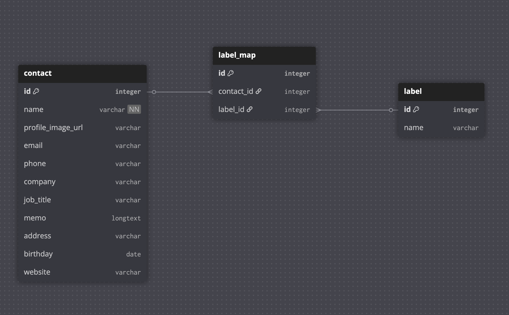

# backend-pre-task

키즈노트 BE개발 사전과제
***

## 개요
연락처, 주소록 정보를 관리하는 API입니다. 연락처의 생성, 조회, 수정 기능을 제공하며, 각 연락처에 다수의 라벨을 연결할 수 있습니다.

### 주요 기능
- 연락처 목록 조회
- 연락처 상세 조회
- 연락처 생성
- 연락처 수정

### 기술 스택
- Python 3.10
- Django 4.2
- Django REST Framework 3.16.0
- MySQL 8.4
- drf-spectacular

## API 엔드포인트

### 연락처 목록 조회
```
GET /api/contacts/
```

#### GET 요청 파라미터
| 파라미터 | 타입 | 기본값 | 설명 |
|---------|------|--------|------|
| `sort_by` | string | `id` | 정렬 기준 필드 (name, email, phone, id) |
| `sort_order` | string | `asc` | 정렬 순서 (asc, desc) |
| `page` | integer | `1` | 페이지 번호 |
| `size` | integer | `10` | 페이지 크기 (최대 20) |

#### GET 응답 예시
```json
{
  "count": 10,
  "next": "http://localhost:8000/api/contacts/?page=2",
  "previous": null,
  "results": [
    {
      "id": 1,
      "name": "홍길동",
      "profile_image_url": "https://example.com/images/hong.jpg",
      "email": "hong@example.com",
      "phone": "01012345678",
      "company": "ABC Corp",
      "job_title": "개발자",
      "labels": [
        {
          "id": 1,
          "name": "친구"
        },
        {
          "id": 2,
          "name": "가족"
        }
      ]
    }
  ]
}
```

### 연락처 생성
```
POST /api/contacts/
```

#### POST 요청 바디
```json
{
  "name": "홍길동",
  "profile_image_url": "http://image.jpg",
  "email": "hong@example.com",
  "phone": "010-1234-5678",
  "company": "키즈노트",
  "job_title": "팀원",
  "memo": "수린이",
  "address": "강남구 논현동",
  "birthday": "1987-11-18",
  "website": "http://www.honggil.dong",
  "label_names": ["친구", "개발자"]
}
```

### 연락처 상세 조회
```
GET /api/contacts/{id}/
```

#### GET 응답 예시
```json
{
  "id": 1,
  "name": "홍길동",
  "profile_image_url": "https://example.com/images/hong.jpg",
  "email": "hong@example.com",
  "phone": "01012345678",
  "company": "ABC Corp",
  "job_title": "개발자",
  "memo": "팀원들과 잘 어울림",
  "address": "서울시 강남구 테헤란로 123",
  "birthday": "1990-01-15",
  "website": "https://hong.dev",
  "labels": [
    {
      "id": 1,
      "name": "친구"
    },
    {
      "id": 2,
      "name": "가족"
    }
  ]
}
```
### 연락처 상세 수정
```
PUT /api/contacts/{id}/
```

#### PUT 요청 바디
```json
{
  "name": "김철수",
  "email": "kim@example.com",
  "phone": "010-9876-5432"
}
```

## ERD



### 테이블 설명
- **Contact** : 연락처 정보를 저장하는 메인 테이블
- **Label** : 라벨 정보를 저장하는 테이블
- **LabelMap** : Contact와 Label의 다대다 관계를 위한 중간 테이블


## API 문서화

Swagger UI는 `/api/schema/swagger-ui/` 경로에서 확인할 수 있습니다.

## 프로젝트 실행 방법
### 1. Docker 컨테이너 실행
```
1. docker compose up

2. localhost:8000/api/schema/swagger-ui/ 확인

도커 실행시 01_schema.sql, 02_data.sql 자동으로 실행됩니다.
